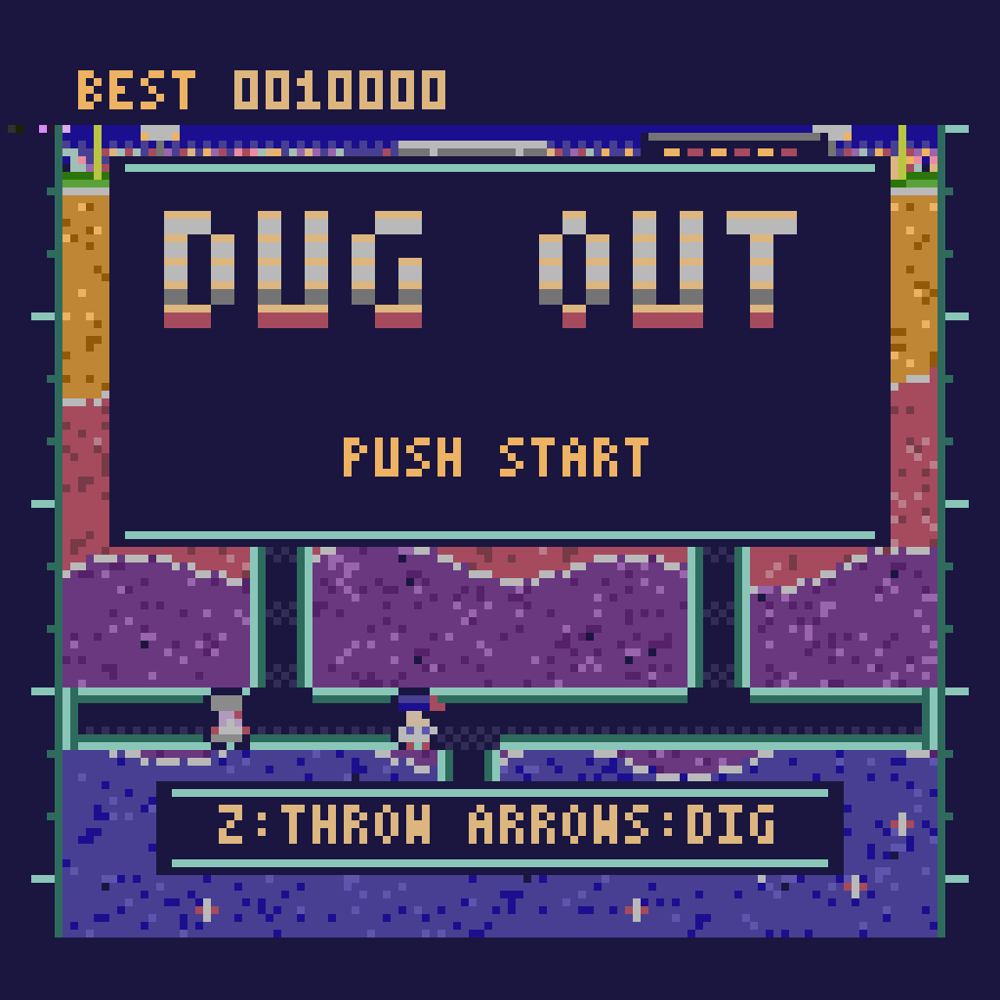
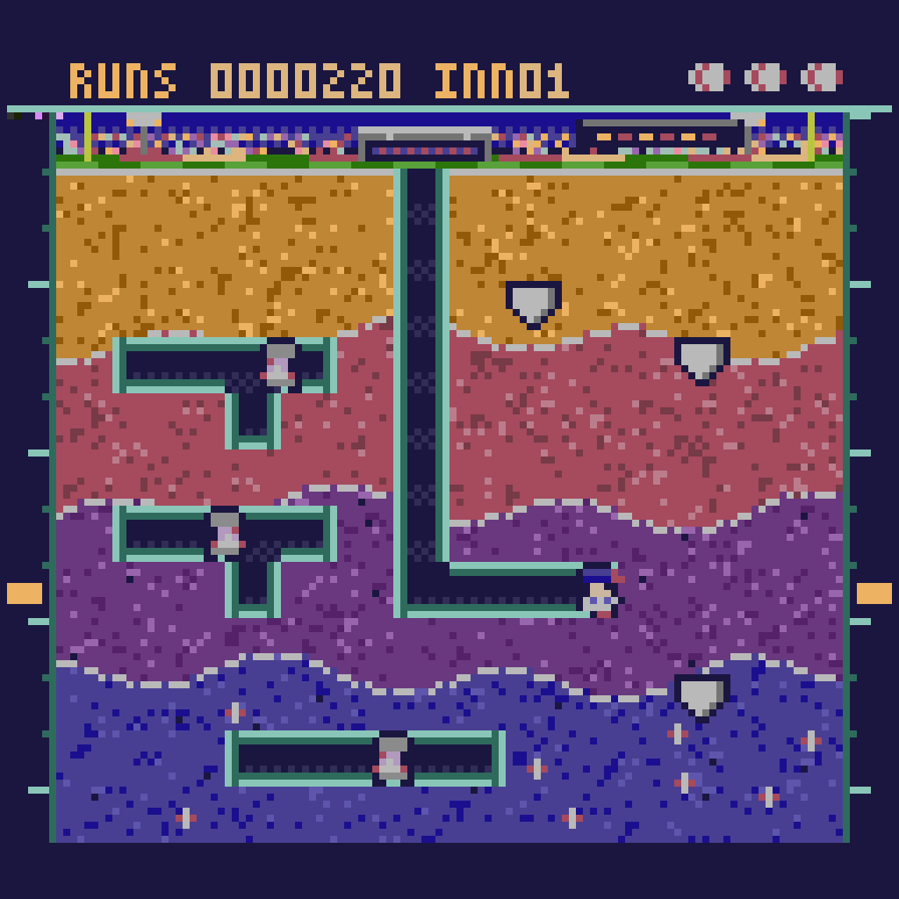
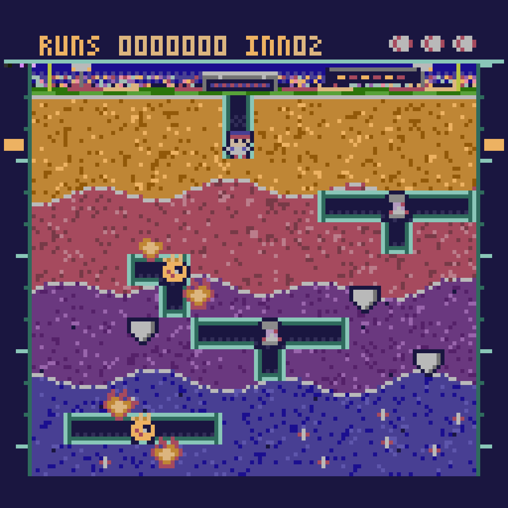
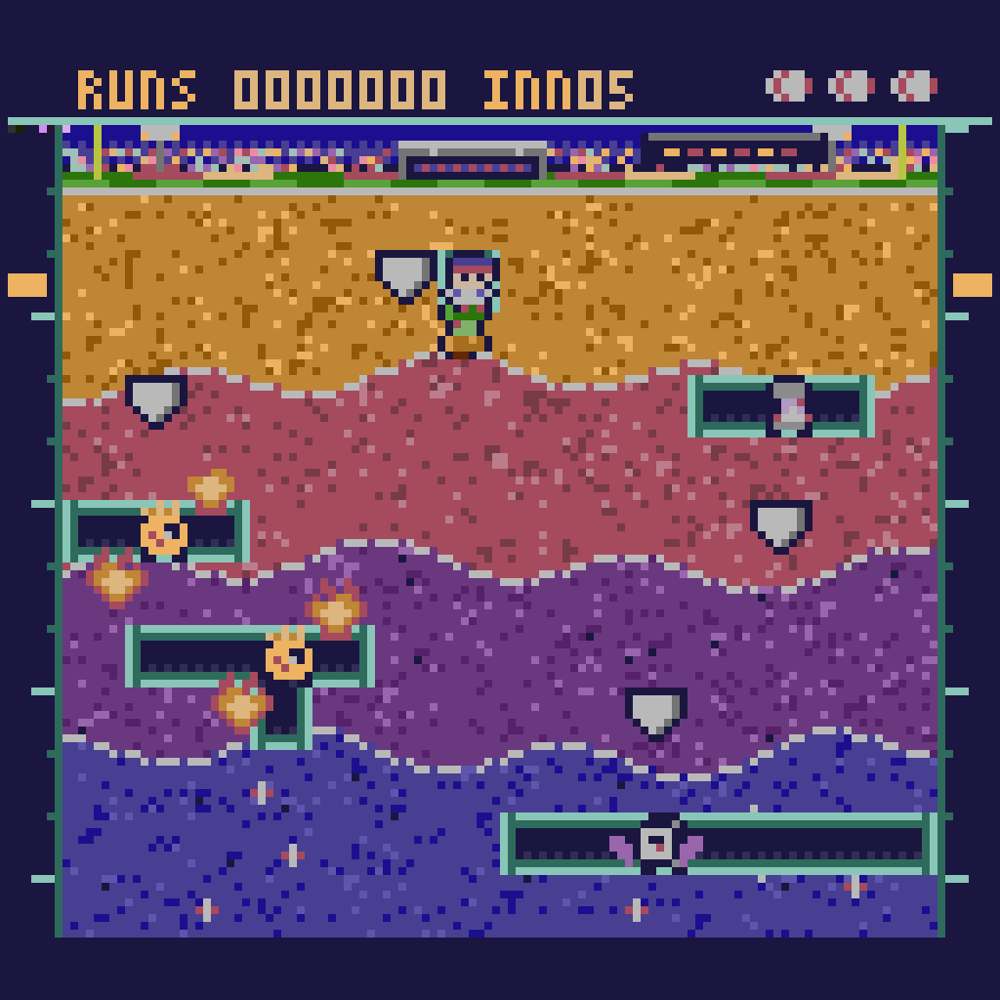
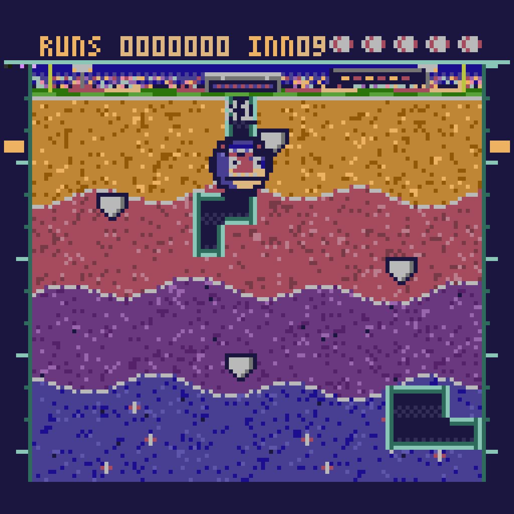

# DUG OUT

A spooky homage to DigDug about baseball for the Gametank. Works in an emulator and real hardware.

## Screenshots

Frames captured from the game running in the GameTank emulator (version 1.3.0).

<p>



</p>
<p>



</p>

## Play

Current version: see `VERSION` and `CHANGELOG.md`. The ROM for each release is in `releases/` (load it in any GameTank emulator). A browser build is in `docs/`.

```sh
./run.sh            # build the ROM and launch it in the emulator
```

| Key (emulator) | Action |
|---|---|
| Arrow keys | Dig / move |
| `Z` (A button) | Throw a baseball |
| `Enter` (Start) | Start / pause |

* Every hit is a **strike**: X1 in white, X2 in yellow, and the third (X3, red) is an out. Leave an enemy alone and its strikes wear off.
* Dig out from under a home plate and it wobbles, then falls. It crushes anything below - **including Doug**.
* **Vumpires** walk the tunnels and can **raise fallen Vumpires**: a struck-out Vumpire leaves a headstone, and a living Vumpire that reaches it brings it back - unless every Vumpire is gone. Stomp a headstone to stop it. Home plates finish them for good.
* **Heaters** (inning 2+) breathe fire along a straight tunnel after a short wind-up (watch for the blink), and two fireballs circle each one, so keep your distance and throw.
* **Baseball Bats** (inning 3+) are winged baseballs that fly straight through dirt at Doug. They wait a few
  seconds at the start of each inning, and your throws can hit them even inside dirt.
* **Groundskeepers** (inning 5+) are no threat to Doug's life, but they wander the tunnels and rake them shut behind them, taking back the points those blocks paid. They count toward clearing the inning, so strike them out too.
* **The final inning** is a single boss, **Mad Scott**: a huge slow foam-head that smashes a tunnel through the dirt straight at you and takes six
  strikes (a home plate counts as three). Beat it to win.
* Deeper critters and multi-kill boulders score more. Tunnelling pays too: 10, 20, 30 or 40 points per block by depth, and the Groundskeeper takes back exactly that when it rakes a block shut. Extra life every 30,000.

## Visual language ("Ballpark Strata")

"Dug Out" is a baseball pun, so the whole game is a cutaway of a ballpark:

* **Doug** is a ballplayer in a cap and pinstripes. The **Vumpires** are vampiric umpires
  (pale, red-eyed, fanged), and **Heaters** are flaming fastballs. **Home plates** are the boulders.
* **Infield clay** on top, then contour-band strata that cool with depth, split by dashed
  **chalk lines**, with baseballs buried in the deepest layer. The surface is the stadium:
  light towers, a crowd, a scoreboard, foul poles, an outfield wall with ads, mown grass, and a
  dugout over Doug's shaft.
* **Lit cutaway tunnels** - dark voids with a mint rim-light on every wall, auto-tiled.
* **Depth gauges** in both margins with a gold marker that follows Doug.
* **Scoreboard UI** - RUNS, INN(ing), baseball icons for lives, "PLAY BALL!" / "STRIKE THREE!".

All art is authored as code + ASCII pixel art in `tools_py/make_assets.py` and quantised to the GameTank's real 256-colour palette.

## How it's built

| Path | What |
|---|---|
| `assets/end/end.bmp` | Full-screen ending art (built by script), shown after inning 9 with fireworks and confetti on top. |
| `assets/over/over.bmp` | Full-screen game over art (built by script): night stadium, moon, and a giant Vumpire umpire calling you out. |
| `src/main.c` | The whole game (state machine, grid logic, enemy behavior, rendering), split across four code banks: `PROG0` gameplay and the main loop, `PROG1` scenes (title, intro, attract, victory, game over), `PROG2` enemies (behavior, contact, drawing), and the fixed bank for shared helpers and the SDK. Calls between banks go through the `bank_call` trampoline (`src/bank_call.s`) via cc65's `wrapped-call`. |
| `tools_py/make_assets.py` | Generates `assets/bg/bg.bmp`, `assets/spr/spr.bmp` and `src/gen_art.h` (sprite coordinates, palette constants, tunnel tiles). |
| `tools_py/make_audio.py` | Generates the `.sfx` effects and MIDI songs in `assets/audio/`. |
| `src/gt/`, `modules/`, `scripts/`, `makefile` | The GameTank SDK (lightly modified: a `vsync_ctr` NMI counter for a steady 30 fps loop). |
| `tools/cc65/` | cc65 built from source - the Homebrew/apt cc65 is too old (`Invalid CPU: 'W65C02'`). |


## Building from scratch

1. Build cc65 from source (the Homebrew and apt packages are too old) and copy it into `tools/cc65/`
   (see the notes in `makefile` and the GameTank SDK readme). Install `zopfli` and Node.js.
2. `python3 tools_py/make_assets.py && python3 tools_py/make_audio.py`
3. `make import && make` builds `bin/dugout.gtr`.

## Credits

* Game design: bushnrvn.
* GameTank SDK by Clyde Shaffer (https://github.com/clydeshaffer/gametank_sdk). `src/gt/`, `modules/`, `scripts/` and `makefile` come from it.
* GameTankEmulator by Clyde Shaffer (https://github.com/clydeshaffer/GameTankEmulator), MIT license.
* Music: Grieg, Hall of the Mountain King, and Take Me Out to the Ball Game (1908), both public domain.
